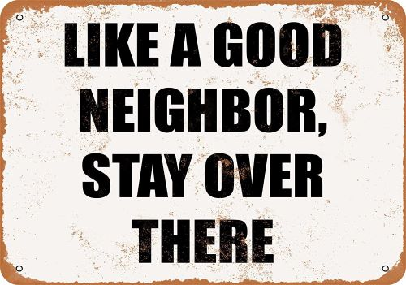

 
 

# Air Gapped
Being somewhat of an introvert. Okay as an introvert, I thought COVID-19 would have little to no effect on my daily life. In the grand scheme of things, it hasn’t, no one directly close to me has gotten sick and thankfully neither have I. I truly hope that remains the case. Apart from that keeping distance from one another hasn’t been a big challenge for me personally, but even I am yearning for interaction I got by coming to campus. Fortunately I have been able to connect with most of classmates online and maintain my sanity.

# Work/Study from Home
I thought that the moving of all my classes online would make the classes I was already struggling in more difficult and the ones I was succeeding in even easier. Turns out, thus far, the opposite has been true. Certain classes just need you to dedicate time to them and revisit them day after day. Which if you are cooped up inside all the time is a little easier to achieve. It has given me the time to re-evaluate what I was doing previously and think about how I translate this success to other classes. 

# Doing the Five
The most critical we all can do is listen to public health experts and do the five. They are easy and I am sure you have heard about them by now but if you didn’t here they are:
1.)	Stay home as much as you can
2.)	Keep 6 feet apart from one another
3.)	Wash your hands thoroughly and often
4.)	Cover your mouth when you cough, or cough in your elbow
5.)	If you are sick and need help call ahead before you arrive
Apart from that we all need to remember something else in these trying times. Do not panic. Again, do not panic. Lastly, don’t panic. No one makes their great choices when they panic. You aren’t helping yourself or others by panicking. Take a deep breath, relax and think it through. You may take longer to decide but it’s okay now more than ever you have enough time. 
