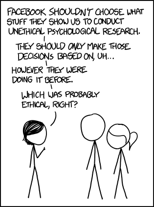

Ethics has fascinated man-kind for centuries and we still don't know where we as a species stand. Not only are there different types of ethics that you can choose to follow. They tend to conflict with one another when conducting thought experiments. Who's following ethical high-road and who is making compromises? There isn't consensus on that front either.

I bring all of this up to say that my view on ethics in software engineering are my own. They are certainly flawed and can be picked apart with enough scrutiny. With that out of the way here's what it means to me to be an ethical software engineer.

# Programming Ethics

### Who am I potentially Harming

This should be the question you answer with every piece of software that you development. The ideal answer won't surprise you. It should be none. Sadly this isn't possible in today's environment. Harm can come from mistakes that you as a software engineer make and by the very nature of the product you are attempting to create. At every step in development you should minimize known harm that you are causing and actively plan for harm that may come with malicious intent. This means making your website as secure as is reasonable.

### Less is More

For virtually every website and service you will need data from people who intend to use your service. If you are trying to minimize harm at each step then your code reasonable bug and performs as intended. Additionally this also means that you should ask for <i>only</i> the information you need. 

For exmaple, do you need an entire user profile to be filled out with location, email, age, and gender just to give them the cheapest gas prices near by? No. You need to know where the user is so you can compare and filter the nearby locations but isn't required either. You could allow the user manually enter a location so don't have to give you their real time location. 

By reducing the amount of information you have you reduce the size of the database that needs to be maintained but you also reduce the potential harm. By not storing all the information about each user there is less harm that can be down to them in the event of a breach. As the mantra goes, less is more.

### Maintain, Maintain, Maintain

The website you built today is reasonably secure, you are only asking for the require information but what else needs to happen? Maintain, maintain and maintain. The most secure website in 2010. Is laughable un-secure by today's standards. While you can go through the process of updating and refactoring the website or by doing the more simple step of taking it down.

Not all the websites built in 2010 need to be torn down. Some have undergone countless revisions, upgrades, and had features added since. If your website hasn't undergone the needed upgrades then it either needs to be upgraded or if no one is using the website it needs to come down. It sounds intuitive but every site you build or feature you implement shows you progression as a software engineer. Having links to your project(s) is a great way to show off your skill(s). Instead move the cool feature forward to a new site or update the old site so it isn't a security vulnerability.

In addition to all of this when in doubt check out the <a href = "https://www.acm.org/code-of-ethics">ACM code of ethics</a> to see if you they can guide down the road of ethical choices.

 
 

# Lights, Data, Breach

After rambling about ethics for long enough lets try and use them in the following real world scenario.

During the 2016 Presidential election there was a vested interest from the Russian government to have one candidate win over the other. To achieve this goal one of the tactics they used was to sow discourse and spread mis-information about the opposing candidate. They primarily did this by meeting people were they are, on Facebook. 

This didn't happen under the nose of Facebook without them noticing. However, as a company with shareholders and a board of directors Facebook, like every other company, has a laser focus goal. Make more profits than last quarter. Keeping this in mind we are able to better understand the decision that Facebook chose. They first decided to hide the fact that is was happening. Then Facebook chose to deny that it happened at all. Then when that was no longer an adequate explanation they attempted to shift the blame to anyone and everyone else remotely involved. Finally, Facebook tone and direction changed, no longer content to sit on its heels it attacked those involved. It should be noted the last step happened when the stock of Facebook plummeted.

 
 

# Bringing Down the Hammer

This sounds damning and after writing it in single paragraph it's easy to see they acted un-ethically some where throughout. For the sake of argument lets examine a few decisions and see how it violates the principles as laid out by the ACM code of Ethics. This also allows us to look at ethical grey areas that even this situation brings to light.

### Hiding the Evidence

By actively attempting to hide the information that a foreign government was working to sow discourse in our political process they allowed (indirectly) for it to continue. This make Facebook partly complicit in the actions that were taken. 

From the ACM 1.2 on avoiding harm "Examples of harm include unjustified physical or mental injury, unjustified destruction or disclosure of information, and unjustified damage to property, reputation, and the environment. This list is not exhaustive."

It is clear to me that by not being forth coming with the information that a hostile government was trying to weigh in on the election that they did in fact create harm. However, this is also a grey area because as an outside entity I will ever know how much Facebook knew and when they did. 

The timing it critical in my opinion to judge if harm was created by them hiding the evidence. If they knew after it was already being reported then they weren't hiding it during the most critical time. They were being asleep at the wheel in a sense.

### Full Court Press

Facebook has gone from hiding the information, to denial, to victim blaming, to lastly attacking those who were critical of Facebook. This is again a moral grey area. It is clear that you be

