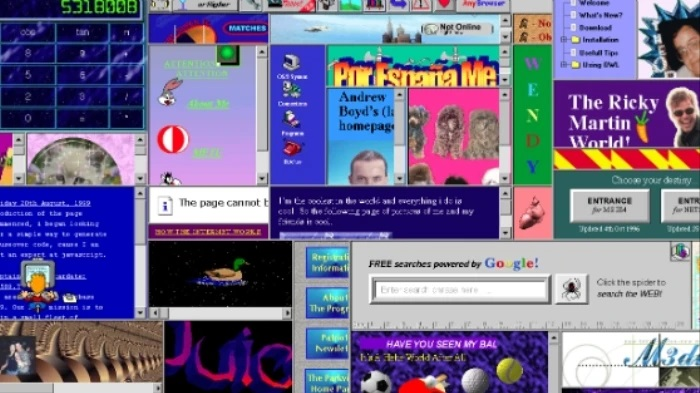

Gone are the days were your webpage is written entirely with html strictly for your geocities web page. Gone are the days where it is written with just html and CSS, by using a framework you make your life easier.

## Frame Up
Now to make a website with all the expected fixings a framework is most often used. Some more popular frameworks are twitter bootstrap and react. In a board sense frameworks don’t provide new functionality. They make it easier to implement key design elements that are “baked in” to the framework. The baked in nature make it easier to maintain a theme across your website. Frameworks also make making modifications easier. With a default look and feel you can use CSS to overwrite a change or two to making your website function the same and look custom built for your new product rollout. 

<p align="center">
  
</p>

## Hurdles 

Well there is an assault on my eyes that can never be taken back. The wonderful amount of color and contrast on this page makes me wish there was less colors and hues available to the site’s owner to contrast with. Jest aside the website itself probably took just as long to make as it did for myself to learn how make a functional navigation bar. Frameworks are almost their own programming language and take a similar amount of effort in order to learn how to use the one that you are using effectively. One hurdle with making them difficult to is the nature in which they are used. They need to exist in a webpage and need to be modified by CSS and/or JavaScript. This means the framework can either be the easiest part to use or the most difficult. Semantic does this well by making the design choices easy to layer and stack on one another to get the desired look and feel. 

## Semantic

Overall using semantic was not too bad. Once you learn how a container and some smaller elements works it becomes more intuitive. Semantic relies on this intuition for more complex design elements. Semantic also play nice with other parts of semantic. For example, if you are making a nav bar and one of items in the bar needs to be a drop down, when you declare the new item you can also declare it as a drop down as shown below:  

```
<div class="ui container menu topmenu inverted borderless">
  <div class="ui dropdown item">
    <div class="text">Test</div>
    <i class="dropdown icon"></i>
    <div class="menu">
      <div class="item">First Item</div>
      <div class="item">Second Item</div>
    </div>
  </div>
</div>
```

This layering makes building more complex design elements with semantic easier. Each higher-level element has more or less the same options. For example when declaring a button or an image you can start the class with ui small … replacing the ellipses with either button or image. This is what makes semantic feel cohesive from element to element, and semantic was enjoyable to learn.

<div class = 'ui label'>Test Label</div>
