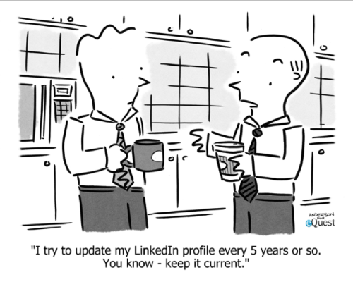

 
  

Software development was not something that initially interested me. I thought that it was about building webpages and having weekly meetings about what color the logo should be. This isn’t something that I was interested in. I was wrong, however.

## Putting Your Work on Display

No one knows you better than you know yourself. That makes you the best person to market yourself to others. There tons of ways to showcase your work and market yourself. For example, if you’re a tattoo artist maybe Instagram is the best way. If you in a more professional atmosphere then you can’t go wrong with LinkedIn, just about everyone already has one or has it in conjunction with other social media platforms. These options give you plenty of choices on how to fill out and setup your profile but what if you didn’t like those options? If you are a software developer, you could instead make your own portfolio and link people to the previously mentioned social media in one fell swoop. Your skills as a programmer also get put on display by demonstrating how you can stylize and format the pages to your liking. In addition to any projects you showcase with your portfolio.

## JavaScript > Java

My pervious programming skills initially gave me a distaste for JavaScript. JavaScript for me was a language you learn to make websites interactive. It also seemed strange that a triple equality would even be needed, but after learning any data type could be put into an array it began to make more sense. It still is far removed in programming but not in name from Java. After my initial crash course with the language I am glad that I am learning it and look forward to learning more about it as a whole.

## Looking Behind the Curtain

Since I don’t much enjoy fussing about with the colors of the webpages what is about software development that I seem to enjoy? I enjoy learning how webpages work and, in a boarder, sense the rest of the internet works. Getting to look under the hood and see what is making it tick has always pique my interest. As I dive further into this topic, I hope to learn more about how CSS, HTML and JavaScript interact with one another to build large professional websites. 
