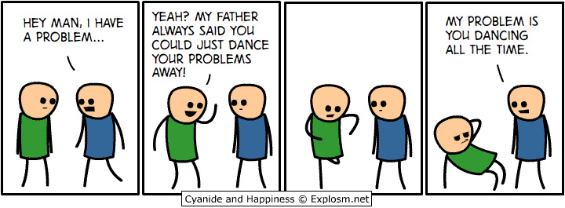

 
  

## Hand in Hand

Programming can be thought of as a dance. The routine from an outsider’s perspective looks fluid, well-rehearsed, and clean. Similar to a dance if you showed up to a ballroom and started doing the funky chicken you would look out of place unless everyone else is also doing the funky chicken. This is what coding standards are trying to do, trying get everyone to agree to what dance is being done. 

## All Together Now

Another similarity to dancing is that if you decide on Friday night to dance in your living room in your undergarments no one would be the wiser. If you showed everyone this is the dance that, you might be embarrassed. Similarly, if your preferred coding style is hap-hazard, messy and putting all your braces on the left-hand side of the IDE then you would also be embarrassed. In addition to being embarrassed if you code is part of a larger overall code base your code is going to be easy to spot out. These intentional choices that you are making aren’t necessarily wrong but they make your code difficult for others to read and debug. Which will be a problem if you need help or for you to help them with their code if they need help. Coding standards help you and your fellow collaborators get on the same page or at least agree to the same dance.

## Saving Time and Your Later Self

It may seem tedious to adhere to having exactly one space after a function name but before the parameters, but it is all done in an effort to make the code uniform and neat. The more neat and tidy the code base becomes the easier it is to spot errors or bugs that will inevitable rear their ugly heads. Taking the time to agree to a standard before a new project is started is the easiest but implementing one after the fact can be helpful for a more junior member of the team to get them used to what is expected of their code when they commit their own changes. In the long run, by having an agreed upon coding standard it will save yourself and your fellow collaborators headaches later on.
