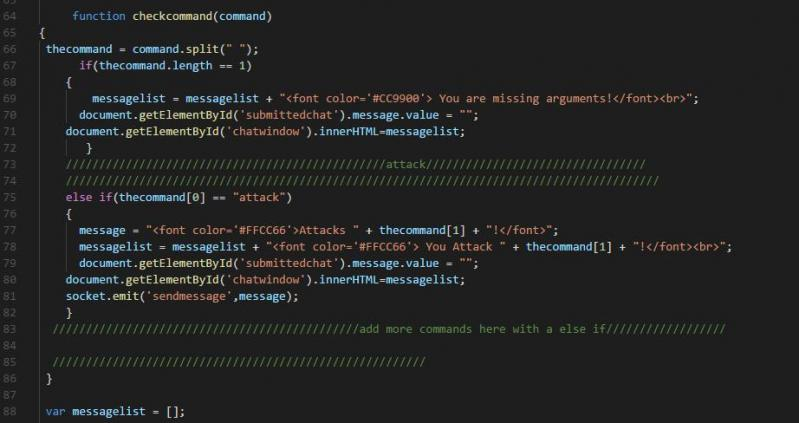

I know what you are thinking. Web design is all about having a never ending scroll of words that dont even sound like english like "var" and "const" and poof out comes a web page. Well the fact of the matter is you are mostly right. Do not panic! Its not all bad! With some software we can make this a lot easier to not only read but to fix (in case its not working right).

## Dreaming in Code

 

     
 

 

If aren't a computer science student or have a job in the IT space you might not have looked at much if any code. You might think that its all a bunch of le3t hackorz typing away a commandline and "poof" the main frame has been hacked. Well that is mostly false. Most work is done via development environment that helps the programmer out with a various assortment of of tools that it comes with. A development environment is simply any tool or program that makes the task easier, and for software engineering  its is almost always a program and it is usually in the form of an integrated development environment or IDE. 

Lipnus test for an IDE is how much easier is it to do things you want to be actively doing want to be doing all the time? If the answer is a lot then the amount of time you save will be worth the cost of time it takes to learn how to use the IDE. Some of the most popular IDE's include: Eclipse, NetBeans, and Intellij. Lets focus on IntelliJ and just some of the things that makes its worth the time it takes to learn how to use it. Most of these apply in to the other IDE's I have listed.

### Shortcutting the Keystrokes

Control-C, control-V, aww the efficiency with four button presses you can copy a single word line or letter and duplicate it somewhere else. Jumping back to coding for a small bit, you might think that every single line in a web page is unique with a specific string of characters and numbers needed to make the computer sing and dance. While that is mostly true, often you need to copy paste. Where to do bug testing or to put up some text in different parts of the website so you can find them later to change them, in the form of a comment. Suffice to say programmers need to copy paste too and Intellij is here to help.

IntelliJ thought 4 key strokes was just to many. Yeah that's how lazy they think developers and programmers are (no comment). So they figured out how to get it down to just 2. Two! If you are say line 36 and need to copy it to the line 37 then all you need to do is press control + d and it will copy the whole line! In fact IntellJ has a whole list of keyboard shortcuts that are a huge help. <a href = "https://www.jetbrains.com/help/idea/mastering-keyboard-shortcuts.html">Here's<a/> a link to the windows shortcuts if you want to see a few more.

One more shortcut in Intellij that is extremely useful is control + alt + l. These three little buttons can save you tons of headaches, this shortcut goes through the entire page you are on and formats to the coding standard of your choice. Every. Single. Line. All properly indented (not spaces) all with a perfect amount of spaces between each bracket string and parentheses so they are all visible without being too spaced out. It just so happen that coding standards are another way that make code less of a garbled mess and more human friendly.

## Everyone Has Standards

 

 
 

Not like this. Not like this. This an example of what code shouldn't look like. Spacing is all off the indentations are non-existent and it is a mess. This is what coding standards tired to avoid. It tries to all code more readable by making all adhere to the same rules. While it may be tedious to have exactly 1 space after the left parentheses and exactly one space between both sides of the equal sign but it is worth the hassle (or not much hassle with Intellij). 

Lets think about it a different way. Imagine you are reading a book, you are interested, the character is just about to find out who drank their milkshake and you turn the page and now its in french. What now? If you can't read french how you would know who drank his milkshake? Coding standards are a like common language between all the pages of a project that allows anyone who can read one page be able to read all of the pages. This doesn't mean there is only one coding standard. There are many different languages and different coding standards. Just find one and apply it to the whole page then to each page in the project to make is easier. 

## Signing Off

Both Coding Standards and development environments are something I intend to use in my career everyday. A flashy new web application or a great new efficient algorithm may get appeal or even praise from your peers or mentor. But, if they struggle to read it because you haven't taken the time to just press three simple keys then they will know. They will judge you for it and won't be as impressed as they should have been at your new improvements to bubble sort.

