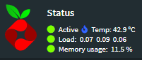
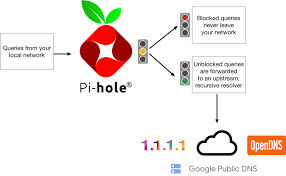

 
 
## My Role
The raspberry pi's were given to the potential recipients of a scholarship funded by the NSF. During the weeklong screening process we had to setup, configure, and as a group add a service that assisted the other members. My contribution was setting my DNS based ad-blocking to deny as many requests as possible to ensure priority traffic such as video game streaming and a plex server as much bandwidth as possible. I used Pi-Hole to accomplish this. Pi-hole made ensuring that all requests from common ad servers were blocked outright and was able to add additional servers to the list to blacklist them if they got around the filter. Another advantage to Pi Hole is that it works in conjunction with internet plugin ad-blockers, as another layer of blocking.

## The Difficulties

* Setting up Raspberry Pi - The raspberry pi can be used right out of the box, but we were instructed to assembly it in the provided case and with the heat sinks. Another hardware related issue was the physical connectors on the pi and my laptop.
* Bash Scripting - This was not a coding style that I was familiar with. Learning the syntax and how to execute basic functions were difficult.

 

 <a href="https://brianchristner.io/how-a-single-raspberry-pi-made-my-home-network-faster/">Brian Christner</a>
 
## My Solution

* The heat sinks were relatively easy to install and setup, but the case was not. It was unintuitive that the top must be put on before the middle and then lastly the bottom. Failing to do so would result in too much pressure being put on the power plug potentially rendering the device useless. Additionally, the limited IO on my laptop and the raspberry PI required a dongle to be purchased to be able to setup the device initially. Afterwards VNC was used to be able to access the device once it was connected to the internet.
* Setting up Pi-Hole was rather straightforward. The detailed guides and forums for questions made the installation rather painless.
* The last member of the group was using bash scripting to perform non-invasive "intrusions" to other raspberry pi's. This was first approved by the moderators of the seminar. With the username and passwords still set default on another members pi were able to remote in and drop a text file saying "Got you.". Using this knowledge we used a script to scan the network for other MAC-addresses that had the same format as our raspberry pi. The "service" was ultimately not able to be completed as the local router was blocking the scans from completing fully. 

Source: <a href="https://pi-hole.net">Pi Hole</a>
