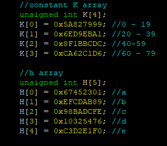
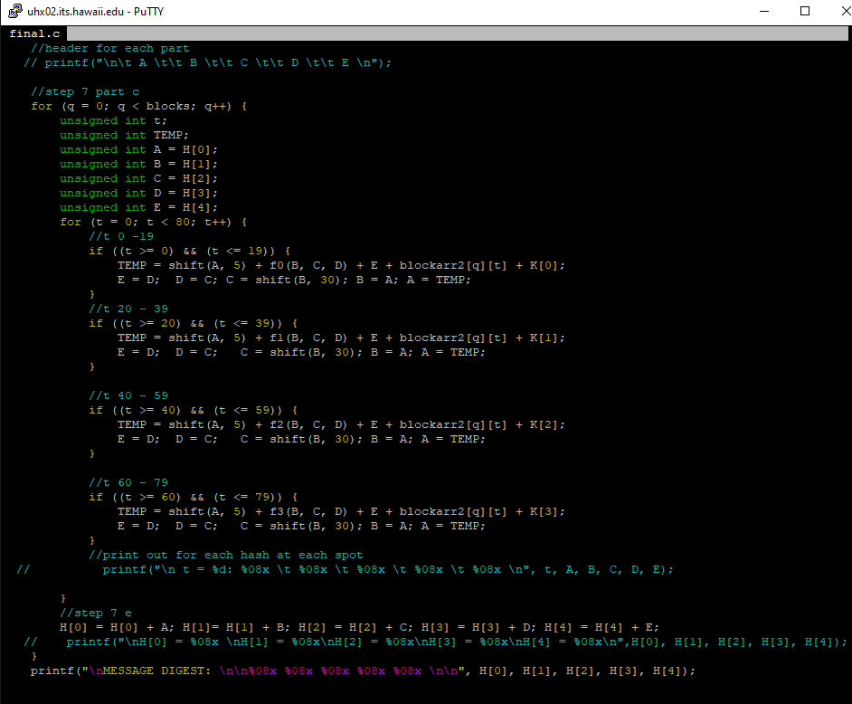

 
 
## My Role
The goal was to create the hashing algorith and test it on the three provided files. Recreating the longer used encryption algorithm was intended to give greater understanding of not only C but for ecryption and decryption as a whole. The bitshifting behind the algorithm(see above) was already given and a general road map is provided to assit in understandig what the code was trying to do. This was extermely helpful once I got on the right track.

## The Difficulties

* File reading - C does not always play nice when accessing or exiting files. Setting the required file and open and close parameters was tedious, as if anything was left out you are left in the dark if the file had been corrupted or not.
* Helper Functions - To keep the already large block of code as compact as possible it was nesscarry to create many helper functions. The problem being was being in this mindset lead to alot of time wasted in attempting to abstract out other parts of the code to funcitons.
* Hex Vaules and Char Values - The code relied on the fact that after the file was read in an end of line character would be placed as the last character. Its HEX vaule not the actual end of line char was required.
* Getting Lost- With the program being of decent size and with many specfic moving parts the code is easy to get lost in.

## My Solution

* Planning and executing the file open/close as the first thing that is done and the last was paramount to ensuring the file was read in properly and not accidently written too. Proper error messages were also key to give information to the programmer.
* Helper functions are a good tool. It took a critical look at which ones were actaully called more than once helped ensure which could be hard coded into the program and which should be a function. If the program only needed to do it once then it didn't need to be its own function and could be written straight into the program.
* Rather than introduce more variables the end of lines character's hex vaule was manually added to the array that held the characters that were read in from the file.
* Detailed, relevant, and specific comments were an absolute must. Not having them intially lead to alot of lost time trying to remember what went where. The almost gratuitous amount of comments paid dividends when I ended up being a peer mentor and other students asked for assitance.

